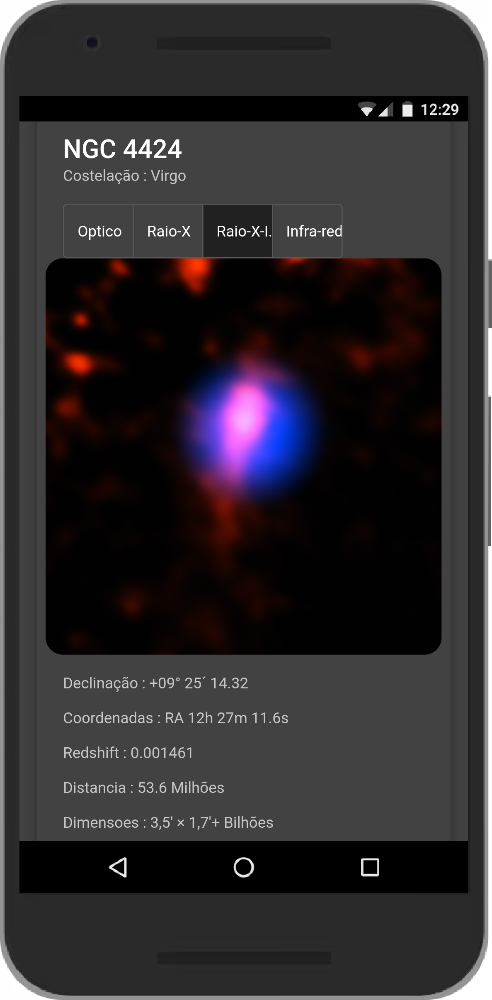

 
 

  
  
  <h3 align="center">Aplicativo mapeador de galaxias e buracos negros.</h3>

  <h4 align="center">
      
    <a href="https://github.com/othneildrew/Best-README-Template"><strong>Explore the docs »</strong></a>
     
     
     ·
    <a href="">Reportar Bug</a>
    ·
    <a href="">Soliciatar recurso</a>
  

## 📸 Screenshots

 
 
 
 
 
 

 

 

 

 

 

 

              
              
              
              
   
 

Algums parametros de ação são necessarios para a execução
### 📋 Pré-requisitos
 
* [NodeJs](https://nodejs.org/en/)
* [Angular 14.0.6](https://material.angular.io/)

Este projeto foi gerado com [Angular CLI](https://github.com/angular/angular-cli) versão 14.0.6.

## 🔭 Como instalar

- Baixe ou clone este repositório usando `git clone https://github.com/Mario23junior/Galaxy-mapping-project.git`;
- Dentro do diretório, instale as dependências usando `npm install`.

## 👨‍💻 Como executar

Execute `ng serve` para executar a versão de desenvolvimento. Depois acesse `http://localhost:4200/`.

## 👩‍🚀 Como compilar/construir.

Execute `ng build` para buildar o projeto. Para buildar a versão de produção adicione a flag `--prod`. Os arquivos serão armazenados do diretório `dist`.
 

## 🪅 Servidor de desenvolvimento.

Execute `ng serve` para um servidor dev. Navegue até `http://localhost:4200/`. O aplicativo será recarregado automaticamente se você alterar qualquer um dos arquivos de origem.
 

## ⛑ Mais ajuda

Para obter mais ajuda sobre a CLI Angular, use `ng help` ou confira a página [Visão Geral da CLI Angular e Referência de Comando](https://angular.io/cli).

## 🔧 🔨 🛠  Construção ⛏ 🪚 🔩 ⚙️

* [Typescript](https://www.typescriptlang.org/)
* [NodeJs](https://nodejs.org/en/)
* [Vscode](https://code.visualstudio.com/)

## 📄 Licença

Este projeto está sob a licença (GNU GPLv3) - [GNU GPLv3.md](https://www.gnu.org/licenses/gpl-3.0.pt-br.html)
